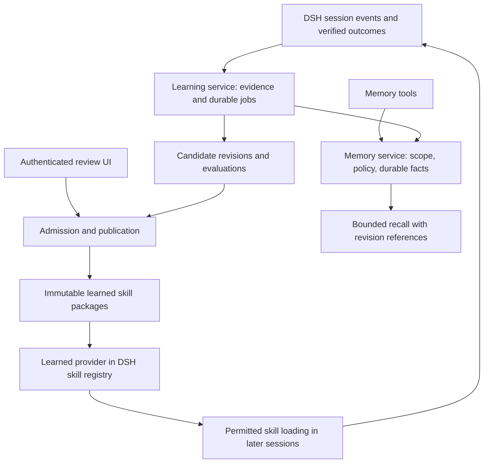

# DSH memory and procedural learning implementation plan

Status: approved and implemented on `codex/memory-learning`. Date: 2026-09-09. See `OPERATIONS.md` for implementation decisions and `VERIFICATION.md` for actual evidence and remaining activation gates. Live-model improvement is not claimed.

## Recommendation

Extend the [DigiStrique fork](https://github.com/DigiStrique-Solutions/dsh-memory), but repair the memory foundation before allowing it to author active procedures. Keep one repository and installable bundle with independently switchable memory and learning components. Reuse the existing DSH skill registry. The learning feature should turn supported evidence into versioned procedures and demonstrate improved performance on later tasks.

This revises the initial documentation-based recommendation: upstream has valuable components, but the [source audit](audit/2026-09-09.md) found authentication, shared-writer, record parsing, revocation, and cancellation defects. Its current raw/journal/summary arrangement is not sufficiently reliable for an unattended learning loop. The [research](research/2026-09-09-learning.md) distinguishes Hermes' implemented background review and skill maintenance from its separate experimental self-evolution project.

## Intended outcome and scope

After a task yields a verified solution or an explicit correction, the system can retain a scoped fact, propose or update a reusable procedure, show the evidence and exact change, publish an admitted version, and use that version in a fresh session. A later correction can supersede it; rollback restores a coherent previous package. Operators can inspect why something was learned, what it applies to, where it was used, and what it cost.

The complete feature includes capture, durable jobs, evidence, candidate review, publication, registry integration, retrieval, usage/outcome tracking, maintenance, migration, rollback, and evaluations. The work packages below sequence dependencies; they are not reduced feature editions.

Excluded: model-weight training, autonomous core-code repair, permission changes learned from content, a new agent framework, a skill marketplace, default cross-machine synchronization, and automatic rewriting of user-owned or upstream-managed skills. Learned scripts may be proposed, but their execution uses normal tool policy and is never authorized merely by creating the skill.

## Compatibility and local integration target

- Fork baseline: upstream `a7d67948336e32663f99468bbdb1194fcb99111c`, version 0.2.11, MIT attribution retained. `upstream` tracks haitang1; `origin` is the organization fork.
- Initial implementation target: DSH 0.1.5-alpha.1 at `5dda764ed3aa172535a7967b06ff95d9cbfe536a`, the inspected local source. Import and real tool-schema compilation succeed, but real Loader use/unload and a full authenticated composition remain release gates. Do not widen the tested compatibility claim to every prerelease admitted by semver.
- Local Node is 26.4.0. Fix test reporting, then test supported DSH Node versions with an explicit reporter. Use one pinned package-manager version and lockfile for development dependencies. Do not install a second Cordis runtime.
- The process discovered during inspection uses an isolated MCP-manager test home. It is not evidence that the user's everyday profile has loaded the new memory plugin. No active profile was modified.
- The workspace `web` profile configures an installed skills manager 0.2.1. Local manager source is 0.3.0, with a separate access service; its broader policy API exists in uncommitted changes in a different Harness checkout. Do not treat those changes as deployed or as stock DSH APIs.
- Stock skills registry supports provider registration and context-aware list/get. Neither the installed manager nor stock registry exposes an authoring service for evidence-bound skill proposals, reviewed publication, or learned-version rollback. The manager keeps its storage instance private.

Keep implementation compatible with stock registry semantics. If the custom skill-access policy is later selected for deployment, explicitly integrate it and require it on every catalog/load path. Do not make that unrelated source migration a hidden prerequisite or silently bypass it with a higher-precedence provider.

## Product behavior

| Situation | Required behavior |
|---|---|
| User states or corrects a durable preference | Store the explicit statement with source and scope; resolve supersession without treating a model's inference as user intent. |
| A tool reports a failure and later tests verify a fix | Preserve the failure and specific verification; propose a procedure with applicability, steps, pitfalls, and verification. |
| Assistant says "fixed" without verification | Candidate may be retained as unverified; no verified-success label or unattended activation. |
| Task is canceled or fails | Retain bounded negative evidence where useful; do not classify it as successful completion. |
| Candidate overlaps an existing learned procedure | Propose a revision against its exact current hash instead of creating a duplicate. |
| Candidate would change a user-owned, pinned, bundled, or externally managed skill | Offer a reviewed patch or a distinct learned skill; do not overwrite its managed source. |
| A new session needs the procedure | Discover only authorized active metadata; load the selected immutable skill package on demand. |
| A fact or procedure is revoked | Remove it immediately from future retrieval and publication eligibility, including pending jobs and derived summaries. |
| No model route or budget remains | Persist pending work and expose the reason; memory reads remain available. |
| Learning is disabled | Cancel/drain its jobs; memory tools and admitted skill discovery continue according to policy. |

## Architecture

Proposed row and API names are design choices, not claims that these services already exist.

### Rows and ownership

Use a single package initially, organized into pure modules and thin DSH adapters. Keep Definition, Provider, and Consumer roles explicit through exported interfaces; separate npm packages only if they later need independent release/version ownership.

| Row/module | Plane and responsibility | Lifetime |
|---|---|---|
| `strique-memory` | Host service owns facts, canonical scope resolution, policy, revisions, import/export, and derived recall. Opens its own durable domain. | Required dependencies through `inject`; stops accepting mutations, drains them, closes domain on disposal. |
| `strique-memory-tools` | Agent-facing adapters installed in the chosen preset. All operations call the Host service with immutable caller identity. | Tools and prompt providers belong to the registering Fiber; removal withdraws them. |
| `strique-memory-learning` | Host service owns extraction queue, candidate records, evaluation references, admission, and learned publication. | Dedicated lifetime controller, tracked operations, bounded queue; drain before releasing handles. |
| Learned skill provider | A module owned by the learning service; registers only admitted active revisions through `ctx.skills.registerProvider`. | Provider control signal and invalidation follow its Fiber. Pending revisions are never discoverable. |
| Memory/learning Client | Optional settings and review presentation. Narrow authenticated Host operations; no secret values or filesystem authority. | Client requests, subscriptions, styles and Slots dispose with the Client Fiber. |
| MCP adapter | Optional adapter to the same authority, or explicit separate-store mode. Never another direct writer to a live Host store. | Connection and requests are bounded and canceled on disposal; absent Host authority means denial. |

Retain one installable bundle containing these rows. Changing layout must remove the old `dsh-memory` row rather than mount two writers. Use a fork-specific package identity such as `@strique/dsh-memory` for internal artifacts and preserve MIT/upstream attribution; publishing to npm is a separate release decision.

### Service operations

The memory contract needs `read`, `search`, `mutate`, `review`, `export`, `import`, and `stats`. Mutation carries expected revision, idempotency key, operation, content, and source references. The Host derives principal, session, workspace/project, policy and allowed paths; the model does not supply authoritative scope keys, permissions, or a success verdict. The service returns stable result/error codes and revision receipts. DSH tools and optional MCP use the same validation and policy.

The learning contract needs `capture`, `listCandidates`, `getCandidate`, `validate`, `decide`, `publish`, `recordOutcome`, `archive`, and `rollback`. Human decisions bind candidate id, exact candidate hash, base skill revision, and permitted target scope. Model-facing operations may propose and inspect permitted evidence; they cannot mint approval or enable a broader scope. Settings belong to the service, not the UI.

Use existing session and tool events for observation. `agent/turn-stopping` is a scheduling signal, not proof of success; read durable event ranges and execution outcomes. Avoid modifying the agent loop. Inspect the pinned schema when implementing the exact event adapter. Recall uses DSH's `systemPrompt.context`, which materializes a durable user-role snapshot on the inspected target. Skill catalog/load and learning decisions need replayable source/version references through the supported session event/projection mechanisms, not an invisible mutable prompt.

### Persistence and publication

Recommended Host persistence: use the existing `ctx.storageDomain` facility for schema-validated canonical records. Its [documented contract](https://github.com/deepseek-ai/deepseek-harness/blob/5dda764ed3aa172535a7967b06ff95d9cbfe536a/packages/storage/storage-domain/README.md) provides durable-before-notify writes and serialized record updates. It does not offer a general cross-record transaction or cross-process coherence guarantee; the implementation must not assume either.

Represent a fact's current revision, tombstone, mutation receipt, and pending-projection marker in one atomic record update. Consumers can retry projection from that record, so a separate append-only text journal is not required for correctness. Keep bounded immutable prior revisions or references for provenance. A skill publication record contains the active object hash, admission receipt, expected prior hash, and status in one commit. Write and validate the immutable package first, then atomically switch that publication record. Recover orphaned staged objects separately. Cross-domain work uses idempotent durable handoffs rather than pretending two writes are atomic.

One Host owns each writable store. Additional profiles/processes either use an authenticated owner adapter or independent stores. Enforce ownership before opening data; shared file paths are not a synchronization strategy. Pure storage abstractions remain testable without a live Harness.

Memory summaries, Markdown exports, search caches, and embedding indexes are derived views. A summary records the exact source revisions it represents. Corrections and tombstones invalidate affected views before recall; omit stale derived material until rebuilt rather than return revoked facts. Consolidation accepts complete evidence records within budget and acknowledges only the included revisions. Publish against a fresh base revision so in-flight consolidation cannot overwrite a newer correction or rollback.

### Candidate and job records

Candidate fields: id; kind; content/package manifest hash; source trust class; principal and project identity; source session/event range; bounded evidence refs; observed time; applicability (repository/tool/runtime versions where relevant); target skill; expected base hash; validator results; decision actor/reason; status; replacement and revocation links. Never trust a source role or event id supplied only in the generated text.

State transitions: `proposed -> validated -> admitted -> active`. Rejection, supersession, and archival are explicit terminal/maintenance transitions. Validation proves syntax or a particular tested property; admission grants use under a specific policy. Do not equate the two.

Jobs persist session/event watermark, idempotency key, candidate/base revision, attempt, model route, budget, deadline, state, and last failure. Read pending work on startup. Coalesce only when a newer evidence range contains the old range completely. Prevent learning jobs from learning their own generated summaries. Derive work from unconsumed eligible source events, not a pruned in-memory timestamp map. Use a dedicated internal worker with no arbitrary shell, browser, deployment, credential, or policy-writing tools.

### Scope, trust, and credentials

Default to a single authenticated owner with project-scoped learning. Global preferences require explicit user intent; project-derived content does not automatically become global. Resolve canonical project/workspace identity from the Host, including worktree/symlink policy. Reject unavailable or unknown scopes. Broad shared-user deployment is unsupported until principal partitioning and authorization have been validated; organization ownership of the code does not imply shared memory data.

Enforce read, capture, mutate, publish, export, and remote-egress policy separately across tools, background jobs, MCP, UI, and service calls. Apply allowed scopes before ranking and before sending data to embedding providers. Treat imported text and tool/web content as untrusted data. Learned text cannot override access policy, enable itself, or expand tool authority.

Use credential references resolved per operation, not API keys in ordinary settings. Keep secret-free status in Client JSON. Apply common synthetic-secret checks before persistence, provider egress, rendered output, logs, and export. Host evidence references should not copy full conversations or credentials into a new uncontrolled store.

## Implementation work packages

| Work | Files/responsibility | Deliverable and acceptance | Depends on |
|---|---|---|---|
| W1: reproducible target and security boundary | `package.json`, lockfile, CI, `lib/web.js`, configuration/types/Client, artifact scripts | Pin supported development target; authenticated settings and credential-reference flow; explicit test reporter; import failures fail instead of skip; synthetic credential absent from all settings views; no lifecycle install scripts. | Audit baseline |
| W2: durable facts and safe migration | `lib/store.js` refactor into canonical store/policy/projection modules, DSH service adapter, migration fixtures | Fix F02/F03/F04/F05/F06/F07; one writer; validated structured records; archived updates/deletes; precise consumption; backup and dry-run import; duplicate/replay/crash tests. | W1 |
| W3: unified tools, scope and lifecycle | `lib/index.js`, memory tools, MCP adapter, search/embedding modules | Fix F08/F10/F11/F12 and listed freshness/import/scope gaps. Provider/path constraints; common policy; scope-aware rollback; cancellation/drain; no late writes; fresh session sees correct active facts. | W2 |
| W4: evidence capture and durable learning | new learning/evidence/job modules and declaration files | Host-derived provenance; explicit correction versus verified outcome; bounded persisted queue; idempotency across restart/fork; candidate validation; controlled negative evidence; cost and failure states. | W2, W3 |
| W5: complete review and skill publication | learning service, learned provider, optional review Client, authenticated Host API | Evidence view and exact diffs; approve/reject; expected-base-hash checks; immutable packages/resources; registry invalidation; protected ownership; active-only discovery; archive/restore and rollback. | W4 |
| W6: evaluations, maintenance and configurable autonomy | evaluation fixtures/runner, outcome attribution, maintenance module/settings | Held-out comparisons, no safety failures, exposure separate from success, staleness proposals, pinning, optional eligible-class unattended admission, daily budgets and pause controls. | W5 |
| W7: release proof | disposable profile fixtures, packed artifact checks, migration/recovery guide, README en/zh | Real Loader install/use/unload/reinstall; recorded fresh-session behavior; migration and reverse restore; exact supported matrix; reviewed tarball with no private files; operational runbook. | W1-W6 |

For each runtime change, update types, config, English/Chinese docs and settings together where applicable. Do not bump or tag a release just for this plan. Add meaningful behavior tests rather than source-regex checks that merely confirm a hook name exists. Preserve upstream fixes through selective merges or cherry-picks, with integration tests at each supported target upgrade.

## Evaluation design and release gates

Compare no memory, hardened memory only, and memory plus procedural learning using the same model, route, prompts, and tool policy. Each trial starts from an isolated store. Train/capture tasks and held-out variants must differ; keep expected answers and acceptance oracles outside the learner's inputs.

Required fixture families: corrected preference; successful troubleshooting with relevant test evidence; failed/unverified fix; canceled turn; duplicate replay; restart backlog; concurrent writers; archived revocation; poisoned webpage/tool output; synthetic secret; cross-project lookalikes; protected skill ownership; resource-bearing skill; stale approval; rollback during consolidation; dependency withdrawal; and a provider that hangs or returns invalid embeddings.

Release gates:

1. All deterministic security and correctness fixtures pass, including zero unauthorized scope reads, secret leaks, stale revision publication, and writes after disposal in the test corpus.
2. Every acknowledged memory change is visible or intentionally revoked after restart; every remaining projection/capture item is still pending or explicitly failed. No invisible dropped work.
3. Reviewed publication produces the exact reviewed complete package, discovered and loaded in a fresh session under permitted scope. Rejection and disabled policies never activate it.
4. Held-out task success and corrected-failure recurrence show improvement over memory-only without an unexplained unrelated-task regression. Use repeated trials and report uncertainty, tokens, and latency. Do not invent a percentage gain before collecting results.
5. Unattended admission is disabled until its eligible lesson classes meet those gates. The completed feature still supports end-to-end reviewed publication immediately; autonomy is a policy choice, not a missing workflow.
6. Artifact, migration, Loader and rollback evidence covers the exact shipped DSH/Node versions. An import smoke does not satisfy this gate.

Track useful retrieval precision, admitted/rejected/superseded candidates, evidence quality, backlog age, token costs, evaluation outcomes and rollback success. "Skill loaded" records exposure, not success. Model-as-judge can supplement behavioral oracles, not replace them.

## Migration, rollout and rollback

1. Freeze the chosen legacy writer and back up its entire directory before migration. This step belongs to an explicitly scheduled activation, not this research task.
2. Import into a separate fork-owned store. Preserve original ids/source filenames where unambiguous, archive provenance, and record invalid/ambiguous Markdown entries for review. Do not infer all original intent from lossy parsing.
3. Keep old files unchanged. Produce counts, checksums, scope mapping, duplicates, quarantined entries, and secret-handling report. Rebuild summaries/indexes from admitted canonical facts.
4. Validate in an isolated profile: fresh-session write/search/correction/revocation, learning review/publication, unload and restart, concurrent-owner rejection, and recovery at publication boundaries.
5. Enable capture in shadow mode for the selected profile, then reviewed skill publication. Enable optional unattended admission only after evaluation and an explicit policy setting.
6. Roll back code by restoring the previous pinned artifact and its matching data backup. Legacy code must never open the new schema. Skill rollback switches an immutable revision pointer while preserving durable revocations. Plugin removal preserves data; purging retained histories is a separate explicit operation.

## Alternatives and open decisions

Rejected: replacing all memory with Hermes or MemOS; adding a vector database before retrieval evidence demands it; mutating the installed manager's private storage; registering pending skills into scanned directories; granting the reviewer shell access to manufacture its own success evidence; copying broad self-evolution claims into product promises.

The plan can proceed against the pinned local DSH target without additional decisions. Before activation, resolve the intended everyday profile and whether the custom skill-policy extension is to be adopted. Default deployment is one owner, project-scoped learning, reviewed activation, local lexical retrieval, existing configured model route with bounded budget, and no new cloud backend. Shared organization memory or unattended changes to external/user-owned skills require a separately specified authority model.
